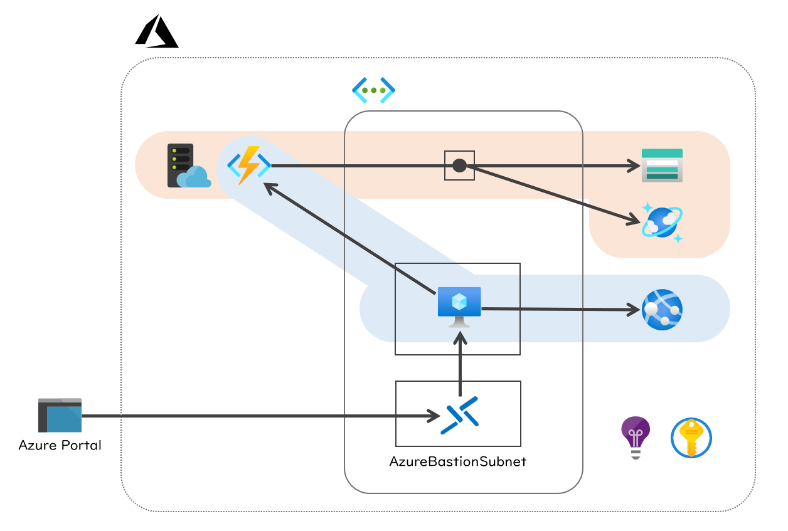

# ARM templates sample for serverless

## Structure



## Key objectives

### App service (Azure Functions)

- Do not allow to access the functions from the Internet
- The functions access to each service endpoints via the delegated subnet
  - Storage Accounts
  - Cosmos DB
- Use Key Vault reference in App settings

### Virtual machine

- Developers can access the VM through Azure Bastion only
- The VM can access to Azure Functions as a service endpoint

## How to deploy this resources

```powershell
$RESOURCE_GROUP="<Resource group name>"
$LOCATION="japaneast"

$PREFIX="<Prefix string with 9 characters>"

$TEMPLATE_URL="https://github.com/dzeyelid/arm-templates-sample-for-serverless/blob/master/arm-templates"

az group create `
  --name ${RESOURCE_GROUP} `
  --location ${LOCATION}

az group deployment create `
  --resource-group ${RESOURCE_GROUP} `
  --name entry `
  --template-uri ${TEMPLATE_URL}/00_deploy.json `
  --parameters `
    prefix=${PREFIX}
```
